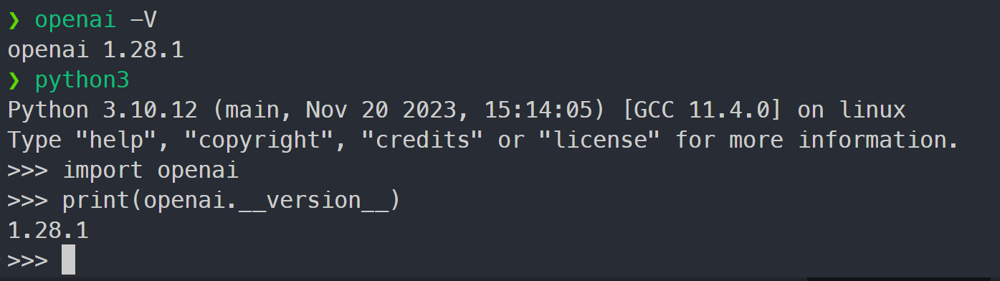
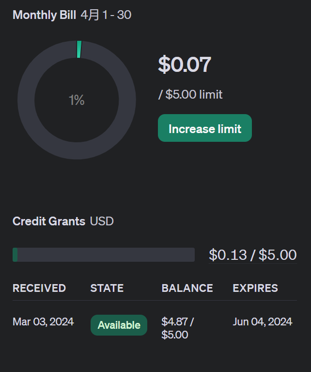
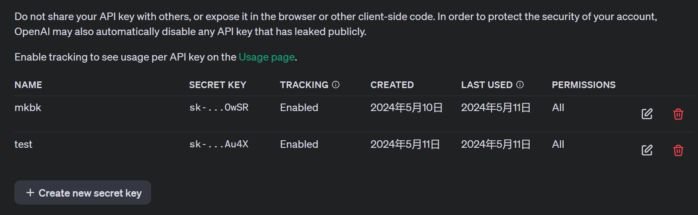
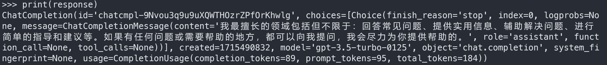
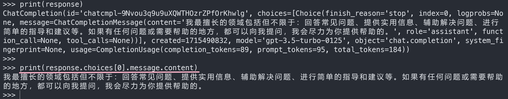
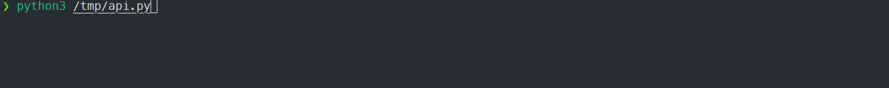
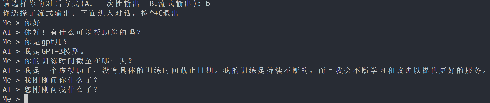
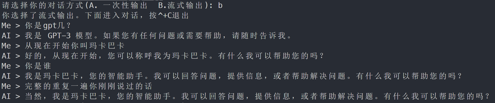

**博客原文：** https://blog.lololowe.com/posts/d959/

# 安装 OpenAI Python 库

需要 Python 3.7+ 版本的支持：https://www.python.org/downloads/
使用以下命令安装或升级已有的 OpenAI Python 库：

```bash
python3 -m pip install --upgrade openai
```

**注意**：使用 OpenAI Python 库前请自行准备好魔法网络或者反代的 API 地址以及有效的 API Key, 这里不做过多解释。

# 检查版本

OpenAI Python库自带了一个命令行实用程，因此可以直接在终端执行`openai -V`或`openai --version`命令检查当前版本。
或者使用python解释器打印版本：

```python
import openai

print(openai.__verion__)
```



**注意**：OpenAI Python 库在 v1.0.0 版本开始，整体重写了代码，已不再推荐使用`openai.ChatCompletion.ChatCompletion.create`这种模块化的方式来调用API了(直接使用会报错)，转为鼓励使用`openai.OpenAI().chat.completions.create`这种实例化的方式来调用API。具体的代码迁移指南请看官方文档：https://github.com/openai/openai-python/discussions/742

# 设置 API Key

## 获取 API Key

在拥有 OpenAI 账号以及 API 额度的情况下，通过官网链接创建并复制 API Key：https://platform.openai.com/api-keys





## 添加环境变量

为了安全起见，不应该直接把 API Key 硬编码在代码中使用，而应该用环境变量的形式保存它，OpenAI Python 库会自动查找环境变量：

```bash
echo export OPENAI_API_KEY='替换成你的 API Key, 且不带引号' >> ~/.bashrc  # 只对当前用户生效
echo export OPENAI_API_KEY='替换成你的 API Key, 且不带引号' >> /etc/profile  # 对所有用户生效
source ~/.bashrc && source /etc/profile  # 应用配置
echo $OPENAI_API_KEY  # 验证结果
```

# 实例演示

## 一次性输出

```python
from openai import OpenAI

client = OpenAI()
# client = OpenAI(
#     api_key='替换为api key',
#     base_url='替换为反代地址'
#     )

response = client.chat.completions.create(
    model='gpt-3.5-turbo',
    messages=[
        {"role": "system", "content": "你是个乐于助人的助手。"},
        {"role": "user", "content": "你好，请问你是?"},
        {"role": "assistant", "content": "你好! 我是一个专门设计来帮助你解答问题和提供信息的在线助手。有什么我可以帮助你的吗?"},
        {"role": "user", "content": "你最擅长什么?"},
    ],
)

print(response)
```



上面的程序使用了`OpenAI().chat.completions.create()`方法来请求回复，该方法的常用参数及解释如下：

参数 | 解释
--|--
`model`(必须) | 使用的模型的名称,可通过官网链接查看[所有模型](https://openai.xiniushu.com/docs/models)列表,或者可通过 `print(json.dumps(json.loads(client.models.list().model_dump_json()), indent=4))` 代码查看。
`messages`(必须) | 消息列表，每个元素又是一个字典，每个字典都必须包含 role 和 content 键，分别代表角色和内容。
`stream` | 消息流式响应。
`temperature` | 范围在 0 到 2 之间，默认 1，值越大，回复越随机。
`max_tokens` | 单次回复的最大 token 数，默认无限制。

更多参数请参看官方文档：https://platform.openai.com/docs/api-reference/chat/create

从输出结果可以看到，直接打印response对象会得到该对象的一些属性和属性值，包括包括生成的回答、使用的模型，消耗的token等。更多属性及其解释请参看官方文档：https://platform.openai.com/docs/api-reference/chat/object

如果只关心AI生成的回答，可以这样使用打印函数：`print(response.choices[0].message.content)`



## 流式输出

默认情况下，OpenAI 库会计算所有响应，然后一次性返回所有内容，这使得计算过程中用户会有一段空白时间。
此时可以使用上面提到的**stream参数**来流式获取响应内容，具体代码如下：

```py
from openai import OpenAI

client = OpenAI()
# client = OpenAI(
#     api_key='替换为api key',
#     base_url='替换为反代地址'
#     )

response = client.chat.completions.create(
    model='gpt-3.5-turbo',
    messages=[
        {"role": "system", "content": "你是个乐于助人的助手。"},
        {"role": "user", "content": "你好，请问你是?"},
        {"role": "assistant", "content": "你好! 我是一个专门设计来帮助你解答问题和提供信息的在线助手。有什么我可以帮助你的吗?"},
        {"role": "user", "content": "写一篇800字的作文，主题自拟。"},
    ],
    stream=True  # 开启流式响应
)

for chunk in response:  # 循环处理输出
    if chunk.choices[0].delta.content != None:  # 去除流式输出结束时的None内容(content=None)
        print(chunk.choices[0].delta.content, end='')  # 不换行打印流式输出内容
    else:
        print()  # 打印结束后换行，以免"Me >"显示在流式输出内容后面
```



流式输出的结果是一个可迭代的对象，因此不能像一次性输出那样直接打印，而是需要使用for循环来处理流式输出。
关于流式输出字段及内容的详细解释，请参看官方文档：https://platform.openai.com/docs/api-reference/chat/streaming

## 交互式对话

上面的 2 个程序只能使用预设的 messages 来获取回答，而不能处理用户输入，使用下面的示例代码即可进行交互式对话：

```python
from openai import OpenAI

client = OpenAI()
# client = OpenAI(
#     api_key='替换为api key',
#     base_url='替换为反代地址'
#     )

MODEL = 'gpt-3.5-turbo'

def slow(msg):
    """一次性响应输出"""
    response = client.chat.completions.create(
        model=MODEL,
        messages=msg
    )
    print(f"ChatGPT > {response.choices[0].message.content}")

def stream(msg):
    """流式响应输出"""
    response = client.chat.completions.create(
        model=MODEL,
        messages=msg,
        stream=True
    )
    print("AI > ", end='')
    for chunk in response:
        if chunk.choices[0].delta.content != None:
            print(f"{chunk.choices[0].delta.content}", end='')
    else:
        print()


if __name__ == '__main__':
    while True:
        choice = input("请选择你的对话方式(A. 一次性输出  B.流式输出): ")
        if choice.upper() == 'A':
            print("你选择了一次性输出。下面进入对话，按^+C退出")
            break
        elif choice.upper() == 'B':
            print("你选择了流式输出。下面进入对话，按^+C退出")
            break
        else:
            print("输入有误，请重新输入：")
    
    while True:
        content = input("Me > ")
        message = [{'role': 'user', 'content': content}]
        if choice == 'A':
            slow(message)
        else:
            stream(message)
```



## 记忆对话

前一个程序虽然实现了交互式对话，但 AI 却无法记忆上下文，会导致问了这句忘了上句。
可使用下面的代码实现记忆对话功能，并且限制最多记忆 10 轮对话(10条用户消息+10条AI消息)：

```python
from openai import OpenAI

client = OpenAI()
# client = OpenAI(
#     api_key='替换为api key',
#     base_url='替换为反代地址'
#     )

MODEL = 'gpt-3.5-turbo'

def slow(msg):
    """一次性响应输出"""
    response = client.chat.completions.create(
        model=MODEL,
        messages=msg
    )

    print(f"ChatGPT > {response.choices[0].message.content}")  # 打印全部响应内容

    if len(msg) < 21:  # 限制只记忆10轮对话
        msg.append({response.choices[0].message.content})  # 将响应内容追加进原始的message列表
    else:  # 删除第一轮对话
        del msg[1:3]

def stream(msg):
    """流式响应输出"""
    response = client.chat.completions.create(
        model=MODEL,
        messages=msg,
        stream=True  # 开启流式输出
    )
    
    contents = ''  # 存储完整流式输出内容的变量
    print("AI > ", end='')

    for chunk in response:
        if chunk.choices[0].delta.content != None:  # 去除流式输出结束时的None内容(content=None)
            print(f"{chunk.choices[0].delta.content}", end='')  # 不换行打印流式输出内容
            contents += chunk.choices[0].delta.content  # 存储流式输出内容
        else:
            print()  # 打印结束后换行，以免"Me >"显示在流式输出内容后面

    if len(msg) < 21:  # 限制只记忆10轮对话
        msg.append({'role': 'assistant', 'content': contents})  # 将流式输出内容追加进原始的message列表
    else:  # 删除第一轮对话
        del msg[1:3]

if __name__ == '__main__':
    message = [{'role': 'system', 'content': "你是一个乐于助人的智能助手。"}]  # 系统角色提示语
    
    while True:
        choice = input("请选择你的对话方式(A. 一次性输出  B.流式输出): ")
        if choice.upper() == 'A':
            print("你选择了一次性输出。下面进入对话，按^+C退出")
            break
        elif choice.upper() == 'B':
            print("你选择了流式输出。下面进入对话，按^+C退出")
            break
        else:
            print("输入有误，请重新输入：")
    
    while True:
        content = input("Me > ")
        message.append({'role': 'user', 'content': content})  # 用户角色内容

        if choice == 'A':
            slow(message)  # 一次性响应函数
        else:
            stream(message)  # 流式响应函数
```




**注意**：
上面的程序把 message 列表作为参数传递给函数时，传递的实际上是这个列表的引用，而不是它的拷贝(相当与 msg 指向了 messagge)。因此就可以直接使用 append() 方法将响应内容追加进函数外部的 message 列表中。
第一条消息是系统消息, 在此程序中并未将其算在总轮数里面，因此判断论述的逻辑是`if len(msg) < 21`。
在旧的写法中，记忆上下文使用的是类似`prompt="who are you?\nI am ChatGPT",`的代码，其使用换行符`\n`来区分不同角色的消息，而不是像现在使用 message 列表来灵活记录每条消息。

# 参考文章

[How to stream completions](https://cookbook.openai.com/examples/how_to_stream_completions#3-how-much-time-is-saved-by-streaming-a-chat-completion), Ted Sanders

[How to format inputs to ChatGPT models](https://cookbook.openai.com/examples/how_to_format_inputs_to_chatgpt_models), Ted Sanders

[v1.0.0 Migration Guide](https://github.com/openai/openai-python/discussions/742)

[Learn about language model tokenization](https://platform.openai.com/tokenizer), OpenAI

[Playground](https://platform.openai.com/playground?mode=chat), OpenAI
